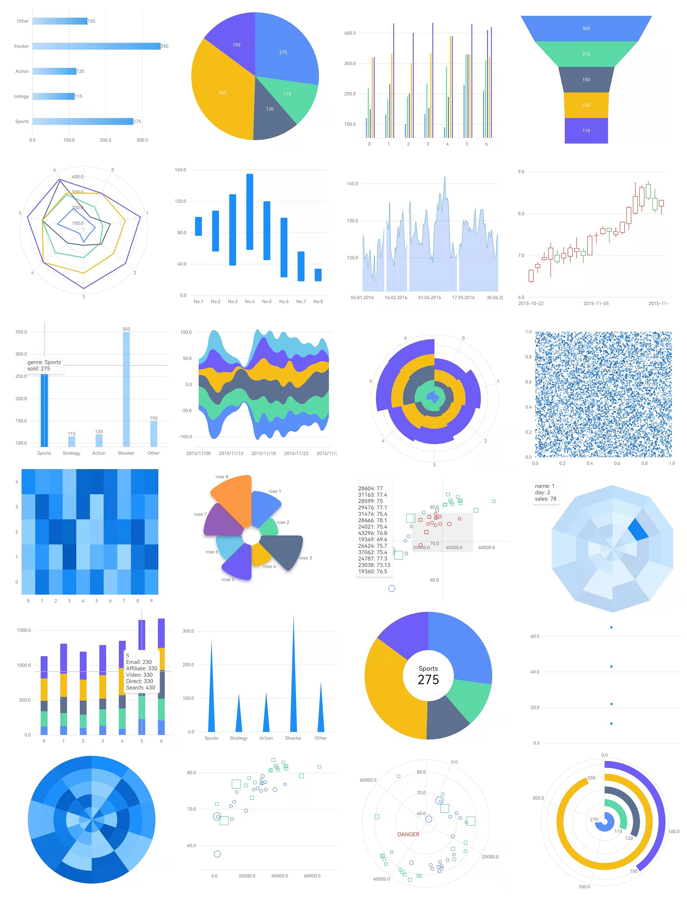

**Graphic is now under a total refactoring. The prior available version code is here: [v0.3.0](https://github.com/entronad/graphic/tree/v0.3.0) .**




*A Flutter data visualization library based on Grammar of Graphics.*


# Usage

**Installing**

[pub.dev](https://pub.dev/packages/graphic/install) 

**Basic example**

```dart
graphic.Chart(
  data: [
    { 'genre': 'Sports', 'sold': 275 },
    { 'genre': 'Strategy', 'sold': 115 },
    { 'genre': 'Action', 'sold': 120 },
    { 'genre': 'Shooter', 'sold': 350 },
    { 'genre': 'Other', 'sold': 150 },
  ],
  scales: {
    'genre': graphic.CatScale(
      accessor: (map) => map['genre'] as String,
    ),
    'sold': graphic.LinearScale(
      accessor: (map) => map['sold'] as num,
      nice: true,
    )
  },
  geoms: [graphic.IntervalGeom(
    position: graphic.PositionAttr(field: 'genre*sold'),
  )],
  axes: {
    'genre': graphic.Defaults.horizontalAxis,
    'sold': graphic.Defaults.verticalAxis,
  },
)
```

**Document**

If you have ever used data visualization libs based on Grammar of Graphics, such as [AntV](https://antv.vision/en) , [ggplot2](https://ggplot2.tidyverse.org/), you can be quite familiar with these concepts.

The document has not been written yet, but by referring to the [Example App](https://github.com/entronad/graphic/tree/master/example) , I believe you can be smart enough to build your charts :)
