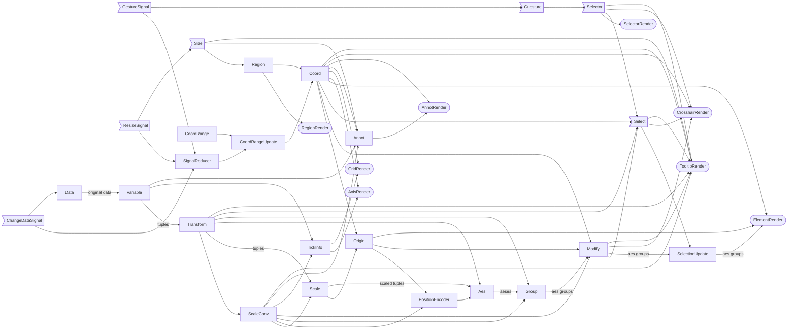

```mermaid
graph LR
    GestureSignal>GestureSignal] --> SignalReducer
    ResizeSignal>ResizeSignal] --> SignalReducer
    ChangeDataSignal>ChangeDataSignal] --> SignalReducer
    ResizeSignal --> Size>Size]
    Size --> Region
    Region --> RegionRender([RegionRender])
    CoordRange --> CoordRangeUpdate
    SignalReducer --> CoordRangeUpdate
    CoordRangeUpdate --> Coord
    Region --> Coord
    ChangeDataSignal --> Data
    Data -- original data --> Variable
    Variable -- tuples --> Transform
    Transform --> ScaleConv
    Transform -- tuples --> Scale
    ScaleConv --> Scale
    GestureSignal --> Gesture>Guesture]
    Gesture --> Selector>Selector]
    Selector --> SelectorRender([SelectorRender])
    Scale --> Origin
    Coord --> Origin
    ScaleConv --> PositionEncoder
    Origin --> PositionEncoder
    Scale -- scaled tuples --> Aes
    Transform --> Aes
    PositionEncoder --> Aes
    Aes -- aeses --> Group
    Transform --> Group
    ScaleConv --> Group
    Group -- aes groups --> Modify
    ScaleConv --> Modify
    Coord --> Modify
    Origin --> Modify
    Selector --> Select>Select]
    Modify --> Select
    Transform --> Select
    Coord --> Select
    Modify -- aes groups --> SelectionUpdate
    Select --> SelectionUpdate
    SelectionUpdate -- aes groups --> ElementRender([ElementRender])
    Coord --> ElementRender
    Origin --> ElementRender
    Variable --> TickInfo
    ScaleConv --> TickInfo
    Coord --> AxisRender([AxisRender])
    TickInfo --> AxisRender
    Coord --> GridRender([GridRender])
    TickInfo --> GridRender
    Variable --> Annot
    ScaleConv --> Annot
    Coord --> Annot
    Size --> Annot
    Annot --> AnnotRender([AnnotRender])
    Coord --> AnnotRender
    Selector --> CrosshairRender([CrosshairRender])
    Select --> CrosshairRender
    Coord --> CrosshairRender
    Modify --> CrosshairRender
    Selector --> TooltipRender([TooltipRender])
    Select --> TooltipRender
    Coord --> TooltipRender
    Modify --> TooltipRender
    Transform --> TooltipRender
    Size --> TooltipRender
    ScaleConv --> TooltipRender
```

