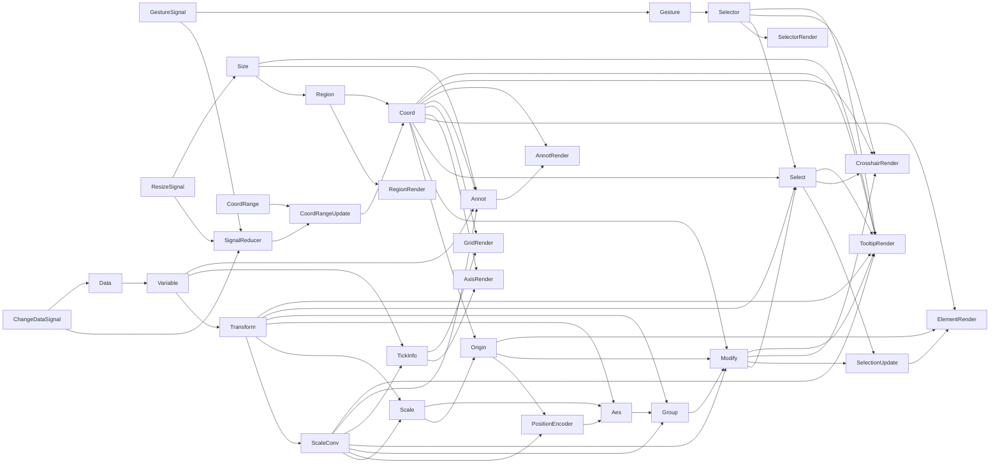
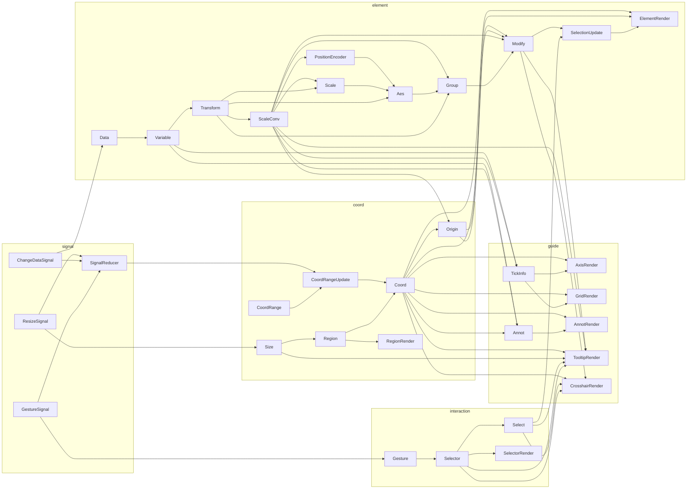

```mermaid
graph LR
    GestureSignal --> SignalReducer
    ResizeSignal --> SignalReducer
    ChangeDataSignal --> SignalReducer
    ResizeSignal --> Size
    Size --> Region
    Region --> RegionRender
    CoordRange --> CoordRangeUpdate
    SignalReducer --> CoordRangeUpdate
    CoordRangeUpdate --> Coord
    Region --> Coord
    ChangeDataSignal --> Data
    Data --> Variable
    Variable --> Transform
    Transform --> ScaleConv
    Transform --> Scale
    ScaleConv --> Scale
    GestureSignal --> Gesture
    Gesture --> Selector
    Selector --> SelectorRender
    Scale --> Origin
    Coord --> Origin
    ScaleConv --> PositionEncoder
    Origin --> PositionEncoder
    Scale --> Aes
    Transform --> Aes
    PositionEncoder --> Aes
    Aes --> Group
    Transform --> Group
    ScaleConv --> Group
    Group --> Modify
    ScaleConv --> Modify
    Coord --> Modify
    Origin --> Modify
    Selector --> Select
    Modify --> Select
    Transform --> Select
    Coord --> Select
    Modify --> SelectionUpdate
    Select --> SelectionUpdate
    SelectionUpdate --> ElementRender
    Coord --> ElementRender
    Origin --> ElementRender
    Variable --> TickInfo
    ScaleConv --> TickInfo
    Coord --> AxisRender
    TickInfo --> AxisRender
    Coord --> GridRender
    TickInfo --> GridRender
    Variable --> Annot
    ScaleConv --> Annot
    Coord --> Annot
    Size --> Annot
    Annot --> AnnotRender
    Coord --> AnnotRender
    Selector --> CrosshairRender
    Select --> CrosshairRender
    Coord --> CrosshairRender
    Modify --> CrosshairRender
    Selector --> TooltipRender
    Select --> TooltipRender
    Coord --> TooltipRender
    Modify --> TooltipRender
    Transform --> TooltipRender
    Size --> TooltipRender
    ScaleConv --> TooltipRender
```

```mermaid
graph LR
    %% signal
    subgraph signal
    ResizeSignal --> SignalReducer
    ChangeDataSignal --> SignalReducer
    GestureSignal --> SignalReducer
    end
    %% signal end
    
    %% coord
    ResizeSignal --> Size
    SignalReducer --> CoordRangeUpdate
    subgraph coord
    Size --> Region
    CoordRange --> CoordRangeUpdate
    CoordRangeUpdate --> Coord
    Region --> RegionRender
    Region --> Coord
    Coord --> Origin
    end
    ScaleConv --> Origin
    %% coord end

    %% guide
    Coord --> AxisRender
    Coord --> GridRender
    Coord --> Annot
    Coord --> AnnotRender
    Coord --> TooltipRender
    Size --> TooltipRender
    Coord --> CrosshairRender
    subgraph guide
    TickInfo --> AxisRender
    TickInfo --> GridRender
    Annot --> AnnotRender
    TooltipRender
    CrosshairRender
    end
    Variable --> TickInfo
    ScaleConv --> TickInfo
    Variable --> Annot
    ScaleConv --> Annot
    Modify --> TooltipRender
    ScaleConv --> TooltipRender
    Select --> TooltipRender
    Selector --> TooltipRender
    Modify --> CrosshairRender
    Select --> CrosshairRender
    Selector --> CrosshairRender
    %% guide end

    %% element
    ChangeDataSignal --> Data
    Coord --> Modify
    Origin --> Modify
    Coord --> ElementRender
    Origin --> ElementRender
    subgraph element
    Data --> Variable
    Variable --> Transform
    Transform --> ScaleConv
    ScaleConv --> Scale
    Transform --> Scale
    ScaleConv --> PositionEncoder
    PositionEncoder --> Aes
    Scale --> Aes
    Transform --> Aes
    ScaleConv --> Group
    Aes --> Group
    Transform --> Group
    ScaleConv --> Modify
    Group --> Modify
    Modify --> SelectionUpdate
    SelectionUpdate --> ElementRender
    end
    Select --> SelectionUpdate
    %% element end

    %% interaction
    GestureSignal --> Gesture
    subgraph interaction
    Gesture --> Selector
    Selector --> Select
    Selector --> SelectorRender
    end
    %% interaction end
```

